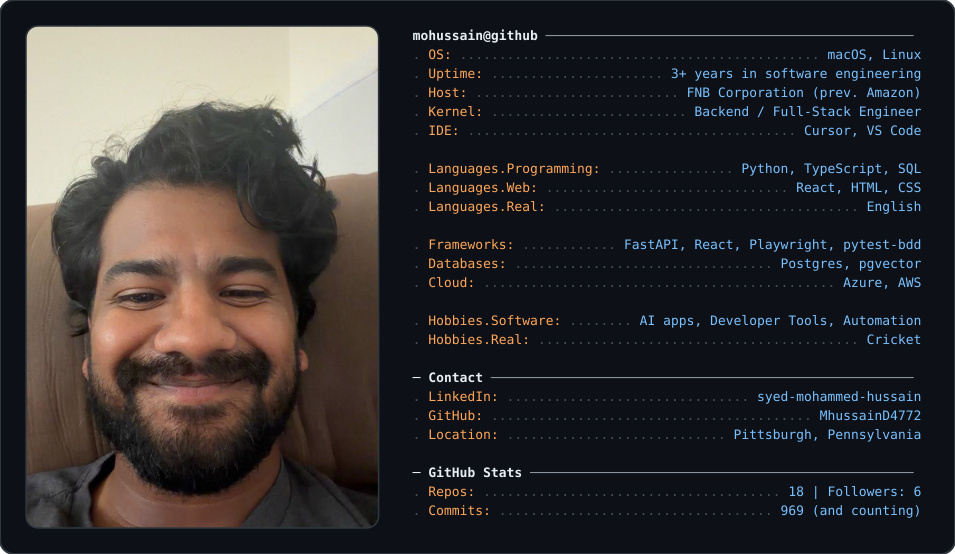
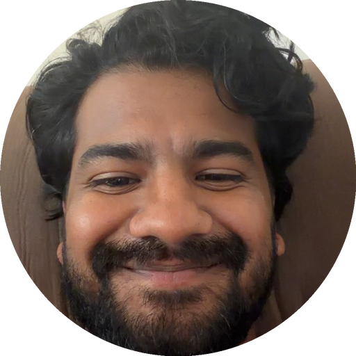

  

 

# Hi there! 👋

I'm Syed Mohammed Hussain, a Software Engineer passionate about building scalable systems, automation frameworks, and AI-powered applications.

I currently work at FNB Corporation, where I contribute to backend systems, workflow automation, ETL pipelines, and full-stack solutions that support business-critical banking operations. My work includes building reliable software, improving existing systems, and exploring how modern tools like AI and automation can make engineering workflows more efficient.

Previously, I worked at Amazon, where I gained hands-on experience with large-scale engineering practices, test automation, CI workflows, and building reliable systems in a fast-moving environment.

My current focus is growing as a Python-heavy Backend Engineer with strong experience in FastAPI, React, system design, automation, and AI integration. I'm especially interested in building practical AI applications, developer tools, and scalable software that solves real-world problems.

Outside of engineering, I'm also deeply involved in cricket, which has shaped the way I think about discipline, consistency, and long-term growth.

Always happy to connect with engineers, AI builders, founders, recruiters, and anyone working on interesting technology.

<!-- The profile card above is generated from profile.png by generate_card.py.
     Regenerate after editing:  uv run --with pillow generate_card.py -->
